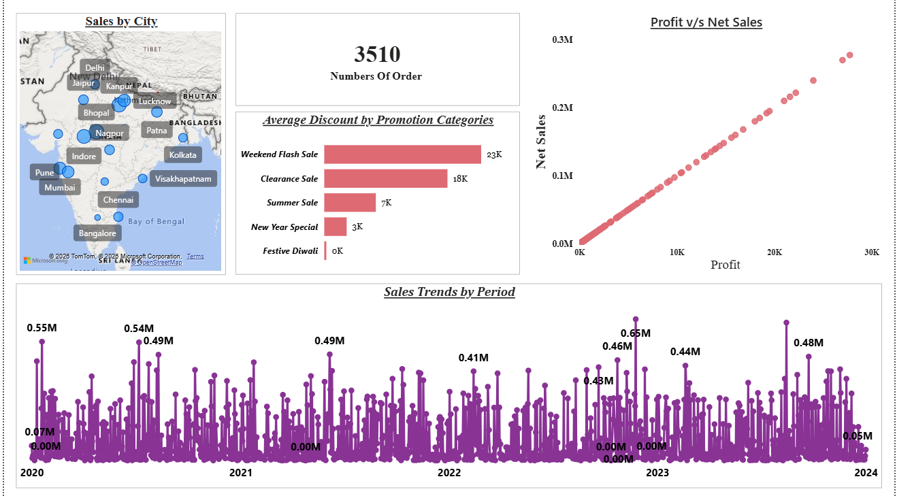
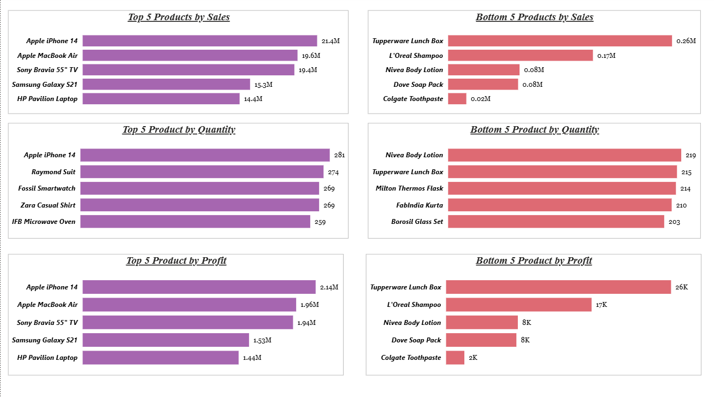
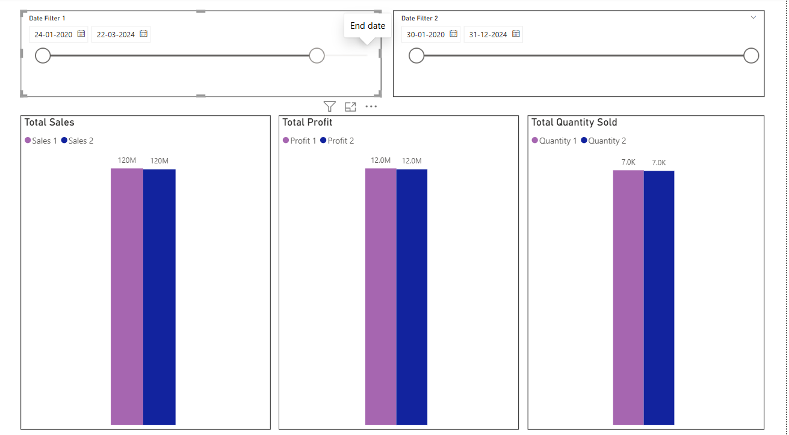
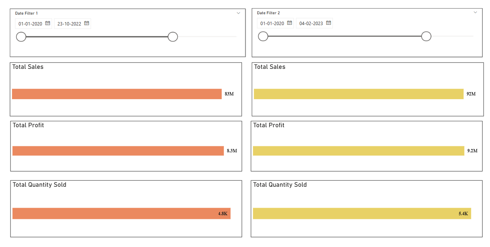
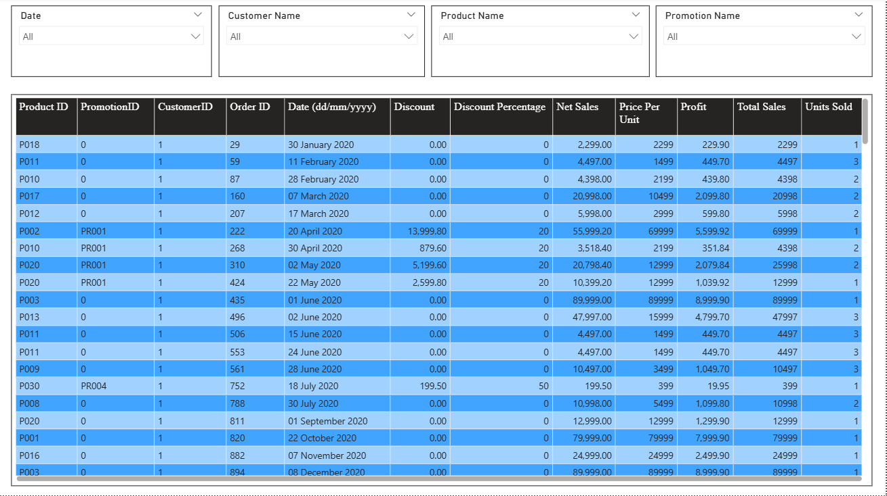

# ElectroHub Sales Data Analysis Power BI Dashboard

## Project Overview
This project focuses on **Sales Data Analysis and Data Visualization using Power BI**. The objective of this project is to analyze sales performance, profit trends, and product performance using an interactive **Power BI dashboard**. The dashboard provides valuable **business insights** to support data-driven decision making.

## Objectives
- Perform **sales data analysis** on a retail dataset
- Identify **top and bottom performing products**
- Analyze **sales, profit, and quantity trends**
- Track **customer purchasing patterns**
- Build an **interactive Power BI dashboard** for business intelligence

## Tools & Technologies
- Power BI
- Data Visualization
- Data Modeling
- DAX (Data Analysis Expressions)
- Data Cleaning
- Business Intelligence

## Key Metrics Analyzed
- Total Sales
- Total Profit
- Total Quantity Sold
- Sales by Product
- Sales by Promotion
- Sales Trends Over Time

## Dashboard Features
- Interactive **Power BI visualizations**
- Dynamic **date filters and slicers**
- Top 5 and Bottom 5 product analysis
- Sales vs Profit comparison
- Product performance insights
- Data table view for detailed analysis

## Project Structure
electrohub-sales-data-analysis-powerbi-dashboard
│
├── electrohub-sales-dashboard.pbix
├── electrohub-sales-dataset.xlsx
│
├── images
│ ├── overview-dashboard.png
│ ├── top-bottom-products-analysis.png
│ ├── sales-profit-quantity-comparison.png
│ ├── edit-interaction-dashboard.png
│ └── sales-data-table-view.png

## Dashboard Preview

### Overview Dashboard

### Top and Bottom Product Analysis

### Sales Profit Quantity Comparison

### Dashboard Interaction

### Data Table View

## Key Insights
- Identified **top 5 and bottom 5 performing products**
- Analyzed **sales trends across different time periods**
- Compared **sales, profit, and quantity metrics**
- Provided insights into **product performance and promotion effectiveness**

## Conclusion
This project demonstrates how **Power BI dashboards and data visualization techniques** can help businesses analyze sales performance and generate **actionable business insights** through **data analytics and business intelligence tools**.
